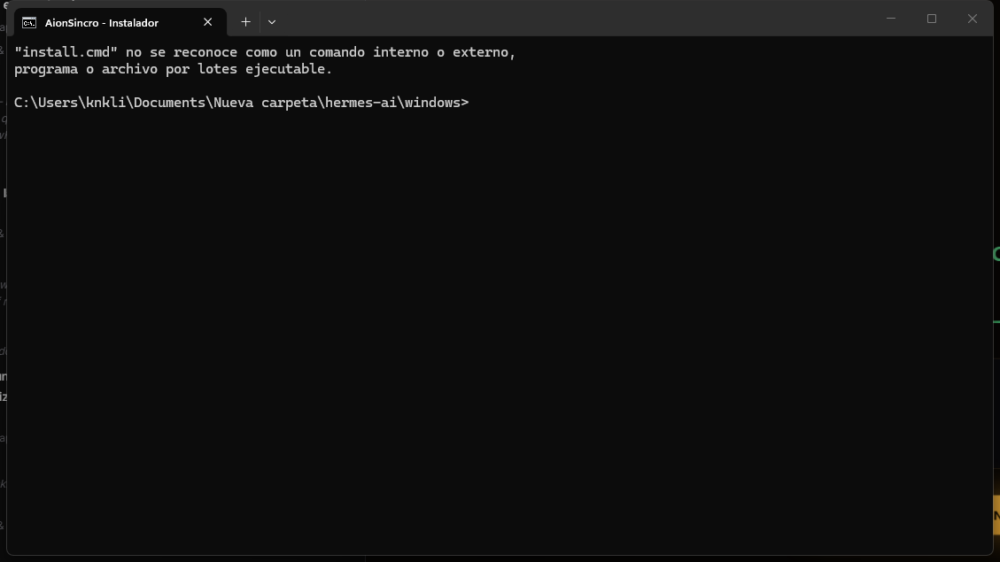
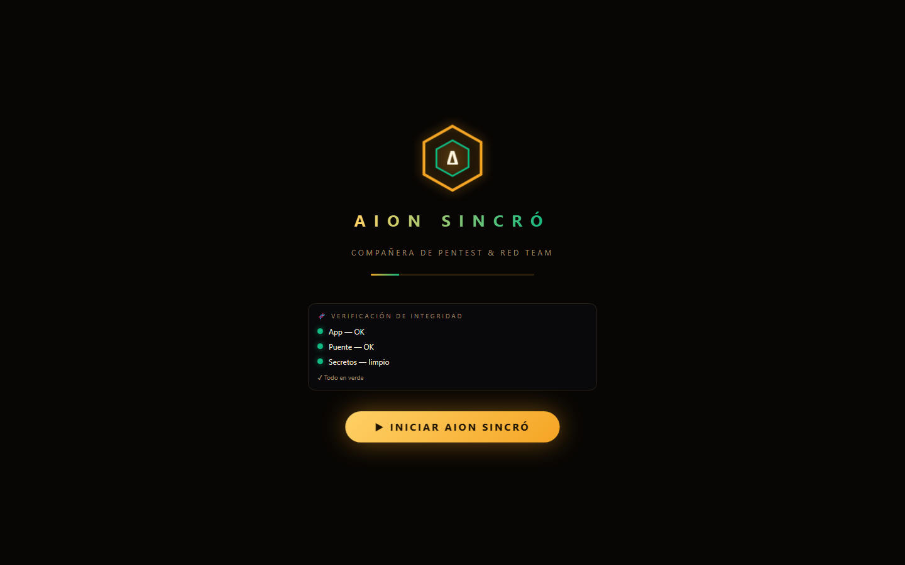

# 🚀 Primera Sesión de Aion Sincro — Actívala en 5 minutos

Guía paso a paso para un **principiante total**. Si sigues estos pasos en
orden, tendrás a Aion Sincro funcionando con **IA real (Mistral)**, **voz
local (Piper)** y **terminal conectada (puente)** — sin leer ningún otro
documento.

> ✅ **Requiere Windows** con **Python 3** o **Node.js** instalados (basta
> con uno de los dos). Navegador: **Chrome o Edge**.
>
> 🎙️ **El micrófono (hotword y conversación por voz) solo funciona en
> Chrome o Edge** — no en Firefox. Si abres la app en Firefox, verás un
> aviso arriba con el botón **«⚡ Abrir en Edge»** que la abre en Edge
> automáticamente (el lanzador ya abre Edge por ti al usar el acceso directo).

---

## 🗺️ El mapa de la primera sesión

| Paso | Qué consigues | Tiempo |
|---|---|---|
| 1. Instalar | La app copiada a una carpeta estable | 1 min |
| 2. Anclar a la barra de tareas | Icono fijo para abrirla con 1 clic | 1 min |
| 3. Arrancar | Web + puente + voz local activos | 1 min |
| 4. Conectar Mistral | Aion responde con IA real | 2 min |
| 5. Comprobar | Ver que todo funciona de verdad | 1 min |

---

## Paso 1 — Instalar la app

Abre una terminal en la carpeta del proyecto y ejecuta el instalador:

```bat
cd aion-sincro\windows
install.cmd
```

Qué hace:
- Copia la app a `%LOCALAPPDATA%\AionSincro` (carpeta estable, no se borra).
- Genera el **token del puente** (archivo `token`) — se crea una vez y se
  reutiliza siempre, así el puente y la app se entienden entre arranques.
- Crea el acceso directo **`Aion Sincro.lnk`** en tu **Escritorio**.



> 💡 **Alternativa sin instalar:** también puedes usar la app directamente
> desde el repo con el lanzador (Paso 3). Instalar solo la hace más estable.

---

## Paso 2 — Anclar a la barra de tareas

Con el acceso directo creado, ancla el **lanzador** (no la PWA de Edge,
que abre la URL pero no arranca los servicios):

```powershell
cd aion-sincro\windows
powershell -ExecutionPolicy Bypass -File anclar-barra-tareas.ps1
```

El script:
1. Crea `Aion Sincro.lnk` en el **menú Inicio** (búscalo escribiendo «Aion»).
2. Lo **ancla a la barra de tareas** por el método del menú Inicio
   (el fiable en Windows 10/11).
3. Borra iconos antiguos duplicados.

> ⚠️ Si al final el icono no aparece en la barra, hazlo a mano en 10 segundos:
> pulsa **Windows** → escribe **«Aion Sincro»** → clic derecho sobre el
> resultado → **Anclar a la barra de tareas**.

---

## Paso 3 — Arrancar todo (web + puente + voz)

Haz **doble clic en el icono de la barra de tareas** (o en
`Aion Sincro.lnk` del Escritorio). El lanzador hace todo por ti:

1. **Sirve la app** en `http://127.0.0.1:8080` (imprescindible para el
   micrófono: el reconocimiento de voz solo funciona en `localhost`).
2. **Arranca el puente de terminal** en `127.0.0.1:8765` (ejecuta comandos
   en tu consola).
3. **Arranca Piper** (si está instalado) en `127.0.0.1:8766` (voz local).
4. **Abre el navegador** con la app y deja las ventanas minimizadas.

> 🔍 **Si algo no arranca**, mira `startup.log` (junto a la app): tiene
> marcas de tiempo con el estado de cada servicio. Es la única forma de
> diagnosticar el arranque automático silencioso.

**Primera vez sin Piper instalado:** la app funciona igual — usa la voz del
sistema de Windows. Piper lo añades en el Paso 4b (opcional).

---

## Paso 4 — Conectar el cerebro de IA (Mistral)

Al abrir la app sin ningún motor configurado, se abre el **asistente de
primera configuración** (botón **🚀 Inicio** de la cabecera). Si no se abre,
sigue estos pasos manuales:

1. Ve a **Ajustes → Motor de IA**.
2. Elige **Mistral** como proveedor.
3. Pega tu **API Key** — la creas gratis en `console.mistral.ai → API Keys`
   (botón *Create new key*). Solo necesitas la clave, sin tarjeta.
4. Pulsa **🔌 Probar conexión** — debe mostrar «conexión correcta».
5. **Guarda** (la clave se **cifra con WebCrypto** AES-GCM 256 en tu
   navegador; nadie más puede leerla sin tu contraseña maestra).


> 🔑 **Modelo por defecto:** Aion usa uno de Mistral gratis/compatible.
> Si no hay clave Mistral, también puedes usar **Ollama** local
> (`ollama pull hermes3`), **Groq**, **OpenRouter** o **HuggingFace**
> (todas con opción gratuita) — ver README → «Conectar un cerebro de IA».

---

## Paso 4b — Activar la voz local Piper (opcional, recomendado)

Para que Aion hable con voz neuronal española **sin internet ni coste**:

```bat
cd aion-sincro\windows
instalar-piper.cmd        rem doble clic también vale
```

Qué hace: crea el entorno virtual, instala `piper-tts`, descarga la voz
`es_ES-sharvard-medium` y **arranca el servidor de voz** en `127.0.0.1:8766`.

Después, en **Ajustes → Voz**, elige una voz **🗣️ Piper local** en el
selector (verás el estado del servidor). Hay voces de España, México y
Argentina (`es_MX-claude-high`, `es_AR-daniela-high`…).

> 💡 Sin Piper, la app usa **Helena** u otra voz del sistema de Windows —
> funciona igual, solo es menos natural.

---

## Paso 5 — Comprobar que todo funciona

En la app ya abierta:

| Qué mirar | Dónde | Señal de que va bien |
|---|---|---|
| **IA real** | Barra de chat | Escribe «hola» → Aion responde con texto |
| **Voz** | Ajustes → Voz | Pulsa el botón de hablar y oyes la respuesta |
| **Micrófono** | Botón 🎤 | Se enciende al pulsarlo (requiere localhost) |
| **Terminal** | Pestaña Terminal | Punto **verde** y «Puente conectado (127.0.0.1:8765)» |
| **Piper** | Ajustes → Voz | Estado del servidor en verde / voz Piper disponible |



### Prueba rápida de 30 segundos

1. Pulsa **▶ INICIAR AION SINCRÓ**.
2. Escribe: **«cuéntame tu historia»** — Aion te narra la crónica de su
   nacimiento (Ark & Jimmy).
3. Pulsa el chip **🔌 Terminal** y escribe `echo hola` — la salida aparece
   en el chat.
4. Pulsa **🎙️** y di «hola Aion» — te responde por los altavoces.

---

## 🩹 Solución de problemas rápidos

| Problema | Causa probable | Solución |
|---|---|---|
| «No puedo hablar / el micrófono no funciona» | Abriste el archivo `index.html` directamente (`file://`) | Usa siempre el lanzador (abre `http://127.0.0.1:8080`) |
| «Puente no conectado» en la Terminal | El puente no arrancó o el token no coincide | Cierra todo y vuelve a abrir el lanzador; mira `startup.log` |
| «Error 403» al ejecutar comandos | Token del puente desincronizado | El lanzador lo arregla solo al arrancar; si usas el puente a mano, pega el `TOKEN DE CONEXIÓN` en Ajustes → Terminal |
| «Aion no responde con IA» | Sin clave o en modo Demo | Paso 4 (Mistral) o elige otro motor con clave gratuita |
| La app no abre al pulsar el icono de la barra | Arranque automático falló | Abre `%LOCALAPPDATA%\AionSincro\startup.log` y mira la última línea de cada servicio |
| Puertos ocupados | Otra sesión anterior abierta | El lanzador los cierra solo al arrancar; si no, reinicia |

---

## 🏁 Resumen del flujo diario

A partir de ahora, **cada vez** que quieras usar Aion Sincro:

1. Clic en el **icono de la barra de tareas**.
2. El lanzador arranca todo (web + puente + Piper) y abre la app.
3. Habla, escribe o usa las herramientas (Ruta Red Team, Laboral, ISO…).

> 💡 Si activas el **arranque automático** (Ajustes → Terminal → «Arrancar
> con Windows», usa `windows/crear-arranque-automatico.ps1`), los servicios
> ya están listos al encender el equipo: el icono anclado abre la app
> directamente, ya conectada.

---

*Sigue la guía de una sola vez y no vuelvas a necesitarla.* Para el resto
de funciones (Ruta Red Team, informes, ISO, OSINT…), ver el [`README.md`](README.md).
